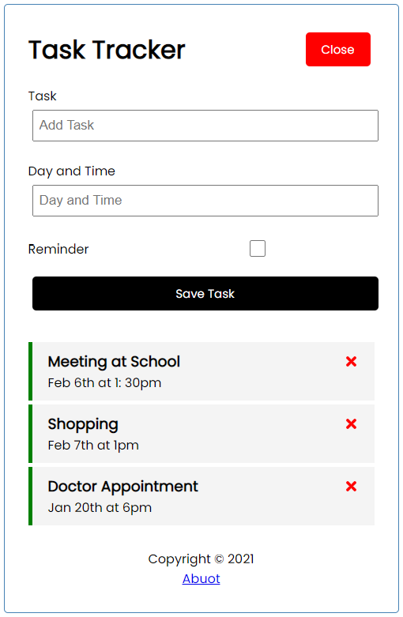

# Getting Started with Create React App

In the project directory, you can run:

- start application:
```cmd
npm start
```
- start JSON_SERVER:
```cmd
npm run server
```
- required dependencies:
```json
 "dependencies": {
    "json-server": "^0.17.0",
    "react": "^17.0.2",
    "react-dom": "^17.0.2",
    "react-icons": "^4.2.0",
    "react-router-dom": "^5.2.0",
  }
```
- user interface:


